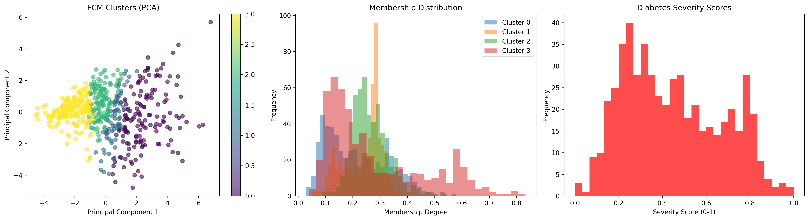

# 🚑 Diabetes Severity Classification — Fuzzy C-Means + Neural Network

[](https://www.python.org/)
[](#license)
[](#overview)

> "Menggabungkan kekuatan Fuzzy C-Means (soft clustering) dengan Neural Network untuk menilai derajat keparahan diabetes secara kontinu — bukan sekedar biner."

---

## 📌 Daftar Isi
- [Overview](#overview)  
- [Kenapa Pendekatan Ini?](#kenapa-pendekatan-ini)  
- [Fitur Utama](#fitur-utama)  
- [Demo Visual (Contoh Output)](#demo-visual-contoh-output)  
- [Struktur Proyek](#struktur-proyek)  
- [Persiapan & Quick Start](#persiapan--quick-start)  
- [Contoh config.yaml](#contoh-configyaml)  
- [Alur Eksekusi (Step-by-step)](#alur-eksekusi-step-by-step)  
- [Tips Praktis](#tips-praktis)  
- [Kontribusi & Lisensi](#kontribusi--lisensi)

---

## Overview
Proyek ini melakukan:
- Pra-pemrosesan data klinis,
- Clustering Fuzzy C-Means untuk menghasilkan membership fuzzy dan skor severity,
- Pelatihan Neural Network (PyTorch) yang memanfaatkan membership sebagai sinyal/target fuzzy,
- Evaluasi menyeluruh dan pembuatan profil pasien.

Output utama: model terlatih, file CSV profil pasien, visualisasi cluster, grafik performa, dan laporan metrik teks.

---

## Kenapa Pendekatan Ini?
- FCM memberikan derajat keanggotaan (soft) sehingga pasien dapat memiliki tingkat risiko gradien, bukan kategori kaku.
- Neural Network belajar memetakan fitur pasien ke membership yang stabil dan dapat digabungkan dengan hasil FCM untuk analisis severity.
- Regularisasi khusus dan teknik anti-overfitting diterapkan agar model lebih robust pada data klinis yang seringkali tidak seimbang.

---

## Fitur Utama
- Pra-pemrosesan otomatis dan scaling.
- Implementasi Fuzzy C-Means (fit, predict, visualisasi).
- Enhanced Neural Network dengan BatchNorm, Dropout, inisialisasi bobot, dan Regularized Fuzzy Loss.
- Early stopping, scheduler, dan opsi Focal Loss untuk imbalance.
- Laporan metrik lengkap: accuracy, AUC, precision/recall/f1, confusion matrix.
- Comprehensive patient profiles (FCM + NN membership & severity).

---

## Demo Visual (Contoh Output)
Gambar dihasilkan pada folder `results/` saat pipeline dijalankan:
- results/fcm_results/cluster_visualization.png
- results/model_performance/confusion_matrix.png
- results/model_performance/roc_curve.png
- results/model_performance/training_history.png

Contoh:  
  
> (Jika menjalankan di lingkungan lokal, buka file di path tersebut untuk melihat hasil)

---

## Struktur Proyek (ringkasan)
- main.py — Orkestrator pipeline  
- config.yaml — Konfigurasi eksperimen  
- src/
  - data_preprocessing.py — Preprocessing & split
  - fcm_clustering.py — FCM implementation
  - torch_model.py — Model, loss functions
  - train.py — Trainer, evaluation, plotting
- data/processed/ — Data terproses
- models/ — Model tersimpan
- results/ — Semua output analisis & grafik

---

## Persiapan & Quick Start

1. Clone repository:
```bash
git clone https://github.com/ardhikaxx/diabetes-fcm.git
cd diabetes-fcm
```

2. (Disarankan) Buat virtual environment:
```bash
python -m venv .venv
# Linux / macOS
source .venv/bin/activate
# Windows
.venv\Scripts\activate
```

3. Install dependensi:
```bash
pip install -r requirements.txt
```
Jika belum ada `requirements.txt`, install minimal:
```bash
pip install numpy pandas scikit-learn matplotlib seaborn pyyaml torch tqdm
```

4. Siapkan `config.yaml` (contoh di bawah). Pastikan `data.path` menunjuk ke CSV dataset yang memiliki kolom `Outcome`.

5. Jalankan pipeline utama:
```bash
python main.py
```

Hasil akan tersimpan di folder `results/` dan model di `models/`.

---

## Contoh config.yaml
Salin contoh ini ke `config.yaml` dan sesuaikan path/parameter sesuai kebutuhan:
```yaml
data:
  path: "data/diabetes.csv"

fcm:
  n_clusters: 4
  m: 2.0
  max_iter: 150
  error: 1e-5

model:
  hidden_dim: 64
  learning_rate: 0.001
  batch_size: 32
  epochs: 100
  l2_reg: 0.001

regularization:
  dropout_rate: 0.3
  use_weight_decay: true
```

---

## Alur Eksekusi (Step-by-step)
1. main.py membuat direktori hasil (data/processed, models, results/...).  
2. Data dibaca dari path di `config.yaml`, dicek missing values & distribusi kelas.  
3. Data diskalakan (StandardScaler) → disimpan `data/processed/normalized_data.csv`.  
4. FCM dijalankan pada training set → centers & membership disimpan.  
5. Membership FCM diprediksi untuk val/test → skor severity dihitung.  
6. Dataloader dibuat (menggabungkan fitur & membership bila diperlukan).  
7. Model NN dilatih (loss ter-regulasi, scheduler, early stopping).  
8. Evaluasi: confusion matrix, ROC, training history, laporan metrik.  
9. Severity analysis dibuat untuk semua pasien → `comprehensive_patient_profiles.csv`.

---

## Hasil & Metrik (Contoh dari repo)
Lihat `results/model_performance/detailed_metrics_report.txt` untuk detail metrik. Contoh ringkasan yang ditemukan:
- Accuracy: ~84.42%  
- AUC: ~0.9165  
- Precision/Recall/F1 per kelas (disimpan di laporan teks).

---

## Tips Praktis
- Pastikan dataset mengandung kolom: minimal `Glucose`, `BMI`, `Age`, `Outcome`.
- Gunakan `n_clusters` FCM yang masuk akal (3–5) tergantung granularitas severity yang diinginkan.
- Aktifkan weighted sampling dan/atau FocalLoss jika dataset sangat imbalance.
- Simpan `config.yaml` untuk melacak eksperimen.

---

## Kontribusi
Terima kasih atas kontribusi! Silakan buka issue atau pull request. Bila menambah fitur, sertakan:
- Deskripsi fitur & alasan,
- Contoh perubahan config,
- Output contoh (jika ada).

---